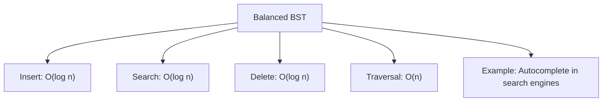
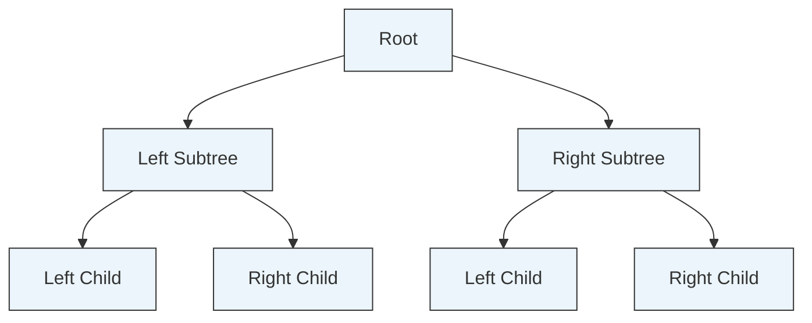

## Balanced Binary Search Tree (BST)

A **Balanced BST** is a binary search tree that keeps its height minimal by ensuring the difference in height between the left and right subtrees is small (often at most 1).  
This balance property keeps operations efficient — typically `O(log n)` for insertion, search, and deletion.  
Balanced BSTs are useful when you need fast lookups while maintaining a sorted structure, such as in leaderboards or autocomplete systems.

The diagram above summarizes the time complexity and a common use case.

Below is a visual structure of a balanced BST showing the relationship between the root, its subtrees, and child nodes.

