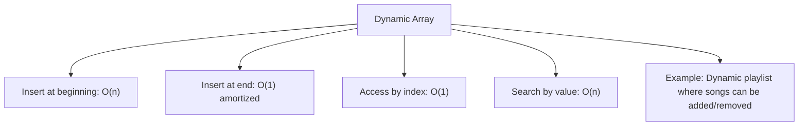
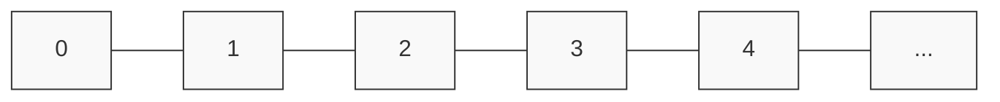

## Dynamic Array

A **Dynamic Array** stores elements in contiguous memory but automatically resizes when it reaches capacity (often doubling its size).  
It allows **O(1)** access by index and efficient appends, but inserting at the beginning or middle requires shifting elements.  
Dynamic arrays are useful when you need quick random access and occasional resizing, such as maintaining a live playlist of songs that can be added or removed.

The diagram above shows the time complexities and a typical use case.

Below is a visual representation of how elements are stored sequentially in a dynamic array.

mermaid
Copy
Edit

