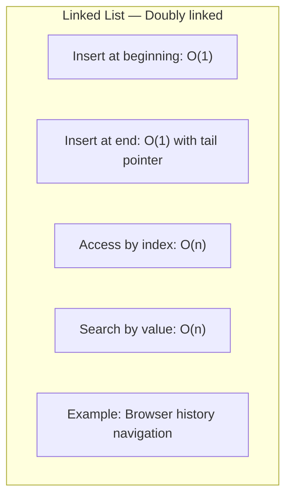
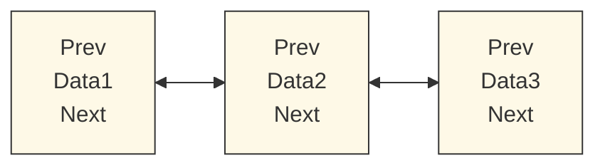

## Linked List (Doubly-linked)

A **Doubly-linked list** is a linear data structure where each node contains data and two pointers: one to the previous node and one to the next node.  
It allows efficient insertion and deletion at both ends or in the middle without shifting other elements.  
However, accessing an element by index requires traversal from the head or tail, making it **O(n)**.  
A practical example is a browser’s forward/backward history, where you can move in either direction through visited pages.

The diagram above summarizes the time complexities and a common real-world use case.

Below is a visual structure of a doubly-linked list showing nodes and bidirectional pointers.

