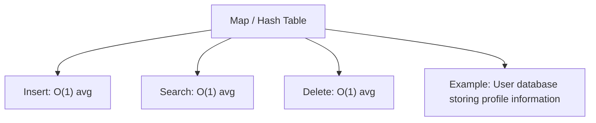
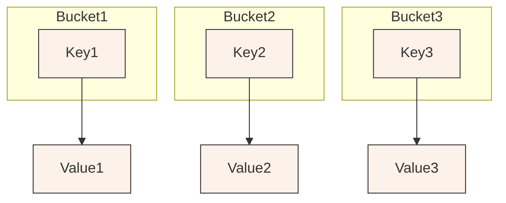

## Map/Hash Table

A map stores key–value pairs, allowing quick lookups by key. Ideal for fast retrieval without scanning all elements. Example: a user database mapping usernames to account details.

