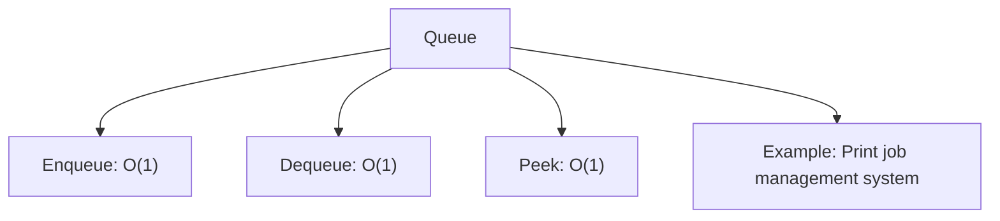
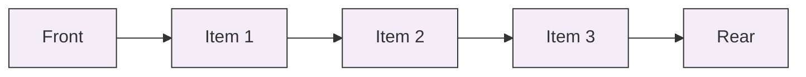

## Queue

A **Queue** is a linear data structure that follows the First-In-First-Out (FIFO) principle.  
Elements are added (enqueued) at the rear and removed (dequeued) from the front.  
It’s ideal for situations where processing happens in order of arrival.  
A common example is a print job management system, where the first document sent to the printer is processed first.

The diagram above shows the operation complexities and a typical use case.

Below is a visual representation of a queue with elements ordered from front to rear.

