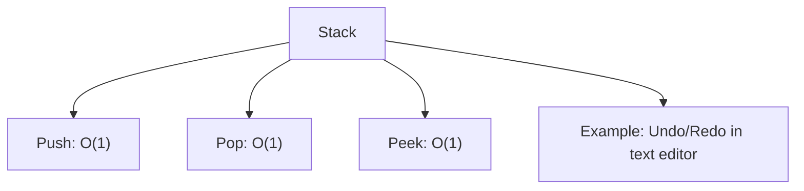
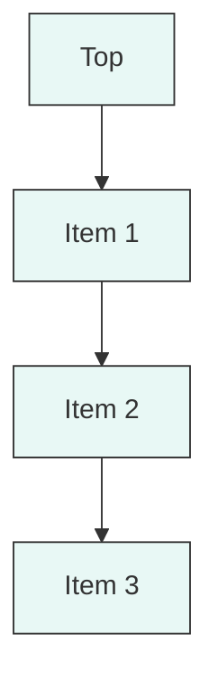

## Stack

A **Stack** is a linear data structure that follows the Last-In-First-Out (LIFO) principle.  
Elements are added (pushed) and removed (popped) only from the top of the stack.  
It’s efficient for scenarios where you need to reverse order or track nested operations.  
A common example is the undo/redo system in a text editor, where the most recent change is the first to be undone.

The diagram above shows operation complexities and a real-world example.

Below is a visual representation of a stack with the top element shown first.

